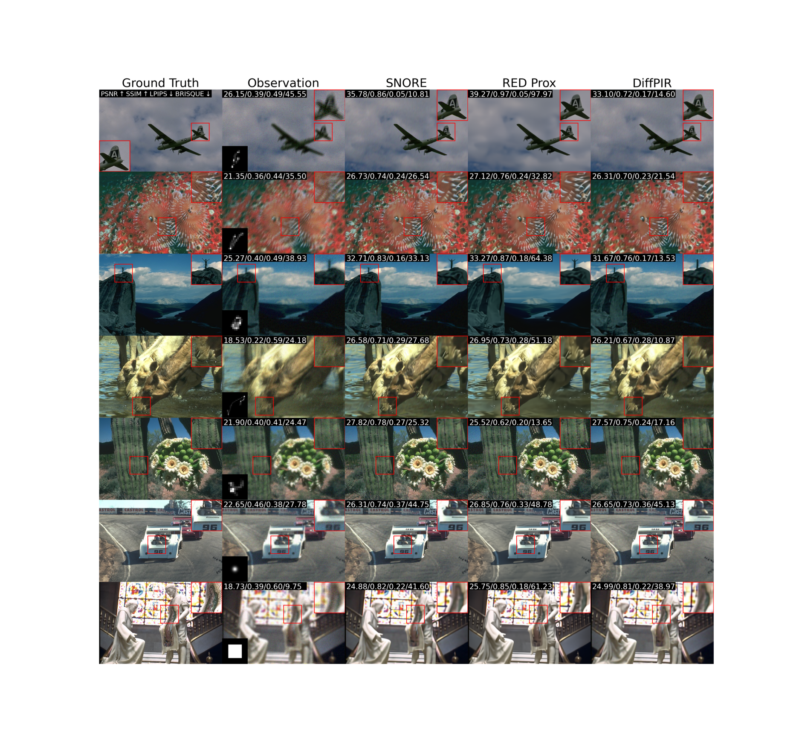

# Stochastic deNOising REgularization (SNORE)

<table>
  <tr>
    <td></td>
    <td></td>
    <td></td>
    <td></td>
  </tr>
</table>


Code for the paper "Plug-and-Play image restoration with Stochastic deNOising REgularization"

To develop this code, we use the code from the paper "Gradient Step Denoiser for convergent Plug-and-Play" published at ICLR 2022. [[github](https://github.com/samuro95/GSPnP)] and the code of the library DeepInverse.

This code is made to test in practice for various inverse problems (deblurring, inpainting, super-resolution) the SNORE algorithm and other kind of methods (RED, RED Prox, DiffPIR, PnP-SGD...) and exploring the practice interest of stochastic version of PnP to solve inverse problem in imaging.

## Prerequisites

To installe libraries of correct versions please run the following command
```
pip install -r requirements.txt
```

## Experiments

Example of experiments are provided in the file PnP_restoration/experiments.sh.

All experiments results are saved in a folder outside the SNORE repository named "Result_SNORE".

### Deblurring

For image deblurring, one can run for instance the following command
```
python deblur.py --dataset_name "CBSD10" --opt_alg "SNORE" --noise_level_img 10. --kernel_indexes 0 --extract_images --extract_curves
```
It compute the SNORE restoration on images of CBSD10 dataset with the kernel 0 and an input noise level of $\sigma_{\mathbf{y}} = 10/255$. "extract_images" and "extract_images" save visual results including optimization curves, annealing parameters curves and clean, degraded and output images.




### Inpainting

For image inpainting, one can run for instance the following command
```
python inpaint.py --dataset_name "CBSD10" --opt_alg "SNORE" --extract_images --extract_curves
```
It compute the SNORE restoration on images of CBSD10 dataset with a mask of probability 0.5. "extract_images" and "extract_images" save visual results including optimization curves, annealing parameters curves and clean, degraded and output images.


## File Structure
```
- datasets : collection of used datasets
- GS_denoising : code to define the Gradient-step denoiser
- images : images for the README.md
- PnP_restoration : code for restoration
  - kernels : collection of kernels used for deblurring
  - utils : some useful functions and settings
  - deblur.py : code for image deblurring with various methods including SNORE, SNORE_Prox, RED, RED_Prox
  - inpaint.py : code for image inpainting with various methods including SNORE, SNORE_Prox, RED, RED_Prox
  - DiffPIR.py : code for image restoration including deblurring and inpainting with DiffPIR. This implementation is inspired by the code of the Python library DeepInverse.
  - GS_PnP_restoration.py : code to compute the optimization with various methods. Note that the optimization process is coded in this file. SNORE, SNORE_Prox, RED, RED_Prox have been qualify. We also provide code for SNORE_Adam (SNORE regularization optimized with ADAM), ARED_Prox (RED_Prox with an annealing procedure) and PnP_SGD (a stochastic gradient descent with a PnP regularization). However, these technics has not been qualified and studied in details, so it is possible that this implementation is not correct.
  - SR.py : code for image super-resolution. Note that the current code is only adapted for SNORE Prox and RED Prox.
```

